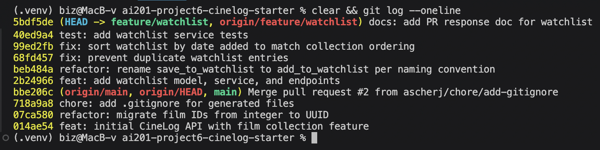

# PR Response Doc — CineLog Watchlist Feature

## AI Usage
<!-- REVIEW AND EDIT so this matches what YOU actually did. -->

I used an AI assistant (Claude Code) in a few bounded ways:

- **Orientation.** Before reading the review comments, I had it summarize
  `models.py`, `services/collection_service.py`, and `tests/test_collection.py`
  to explain what each file is responsible for and, specifically, how
  `add_to_collection()` performs its duplicate check (`filter_by(...).first()`
  then raise `AlreadyInCollectionError`). I verified each summary against the
  actual code before relying on it.
- **Commit-format check.** I pasted my `git log --oneline` output and asked
  whether the messages follow Conventional Commits and whether any commit
  bundled more than one logical change, then checked the answers against the
  spec myself.
- **Rebase mechanics.** I used it to help execute and sanity-check the
  `git rebase origin/main` conflict resolution (see Comment 6).
- **Stress-testing Comments 4 and 5.** After drafting my visibility and
  sort-order positions, I asked "what counterargument would a careful reviewer
  raise, and what tradeoff am I not acknowledging?" What it surfaced for
  Comment 4 was the exposure-by-omission point, which I folded into the
  "Tradeoff acknowledged" paragraph; for Comment 5 it was the large-list lookup
  case, which became my "sort param later" caveat. The final wording and the
  actual positions are mine.

## Comment 1 — Rename
**What I did:**
Renamed `save_to_watchlist()` to `add_to_watchlist()` in
`services/watchlist_service.py` so the watchlist service matches the
project's `verb_to_noun` convention and mirrors `add_to_collection()` in
`services/collection_service.py`.

**Where I looked for call sites:**
Searched the whole project for `save_to_watchlist` (ripgrep / project-wide
find). The only call site outside the definition was the import and call in
`routes/watchlist/watchlist.py`. Updated both the `from ... import` line and
the call inside `add_film()`.

**How I verified:**
- Re-ran a project-wide search for `save_to_watchlist`: zero matches remain.
- `pytest tests/ -v` still passes.

## Comment 2 — Deduplication
**What I did:**
Added a duplicate check to `add_to_watchlist()` following the exact pattern in
`add_to_collection()`: after confirming the film exists, query for an existing
`WatchlistEntry` with the same `(user_id, film_id)` and raise
`AlreadyInWatchlistError` instead of silently inserting a second row. Added the
`AlreadyInWatchlistError` exception class in the watchlist service, and a
matching `UniqueConstraint("user_id", "film_id")` on `WatchlistEntry` so the
database enforces the invariant too (mirrors `CollectionEntry`).

**How I verified the logic works:**
- Modeled the check on `add_to_collection()` (which queries `filter_by(...).first()`
  before inserting and raises `AlreadyInCollectionError`).
- Added `test_add_to_watchlist_duplicate_raises` (see Comment 3 file) asserting
  the second add raises and that only one row exists afterward.
- `pytest tests/ -v` passes.

## Comment 3 — Missing test
**What I did:**
Created `tests/test_watchlist.py`. Modeled it on `tests/test_collection.py`:
same `app` / `sample_user` / `sample_film` fixtures, and a
`test_add_to_watchlist_nonexistent_film_raises` test that mirrors
`test_add_to_collection_nonexistent_film_raises`: adding a film_id that isn't
in the DB raises `FilmNotFoundError`.

**Which test I used as my model:**
`test_add_to_collection_nonexistent_film_raises` in `tests/test_collection.py`.

**How I verified:**
`pytest tests/test_watchlist.py -v` passes, and the full suite `pytest tests/ -v`
is green.

## Comment 4 — Default visibility

> _Working draft: final voice pass so it reads like the rest of my doc._

**My position:** Keep `public=True` as the default for `WatchlistEntry`.

**Reasoning:**
Keeping `public=True` fits how CineLog treats privacy: as a matter of
**curation, not identity**. What the app protects isn't the fact that you like
certain films; it's the verdicts you've deliberately made. That curated layer
lives in the *collection*, which stores your watched films **plus your 1 to 5
ratings**, your taste made explicit. That's exactly why, in the data model, the
collection has **no public/private flag to flip**, while the watchlist does. A
watchlist carries no judgment. It's just intent, a loose "maybe someday" pile,
so defaulting it to public exposes nothing you've curated. It also powers the
social discovery CineLog is built for: a public default is what makes friends
seeing your list, recommendations, and "let's watch this together" work for the
majority of users who never open a settings screen.

Read this way, the schema asymmetry isn't an oversight. The watchlist got a
`public` flag *because* it's the shareable, broadcast-friendly surface, and the
collection didn't because ratings aren't something you toggle on for an audience.

**Tradeoff acknowledged:**
Privacy-by-default is the safer engineering norm, and the reviewer is right that
a public default exposes a user *by omission*: someone who never touches
settings is sharing without an explicit choice, and even intent can be sensitive
(a surprise gift, a personal topic). I accept that tradeoff because the data is
low-sensitivity by the curation/identity distinction above, and because it's
mitigated by an explicit per-entry opt-out. The `public` parameter lets a caller
set visibility when adding an entry, and an account-level default could follow.
If we decided exposure-by-omission outweighs the discovery value, the fix is
`default=False` plus a proper sharing UI so the social features still have data
to work with.

## Comment 5 — Sort order

> _Working draft: final voice pass so it reads like the rest of my doc._

**My position:** Adopt the maintainer's preference: sort `get_watchlist()` by
`date_added` descending (newest first), matching `get_collection()`. (Code
change made in `services/watchlist_service.py`.)

**Reasoning:**
A watchlist is a "save it before I forget" queue: a user adds a film the moment
they hear about it, then comes back to see what's fresh and what's next. So the
most recent add belongs at the top, where their attention already is.
Alphabetical order fights that: a fresh save lands in the middle of the list
where it's easy to miss, and title order only helps if you're hunting a film you
already know by name, which isn't the main thing a watchlist is for. Newest-first
also keeps CineLog's two list screens consistent (`get_collection` already made
`date_added desc` the app's convention), which is one less mental model for users
and one less sort rule for maintainers.

**Engagement with reviewer's point:**
The reviewer is right on both counts (the two endpoints were inconsistent, and
the collection's newest-first is the better convention), so I've implemented it
rather than defend alphabetical. Where I'd push the thinking further: honestly,
neither date nor title is the **S-tier** sort for a watchlist. The most useful
order would be by **how well-liked a film is**, using the `average_rating` the
`Film` model already stores (`order_by(Film.average_rating.desc())`), because
the real question a watchlist answers is "what should I actually watch tonight,"
not "what did I add most recently." (`average_rating` measures *well-liked* more
than raw popularity, which for a watchlist is arguably the more useful signal.)
The right long-term design is a user-selectable `sort` param (newest,
alphabetical, or top-rated) with newest-first as the sensible default. I kept the
change small and in-scope for this PR and flagged the top-rated sort as the
natural follow-up.

## Comment 6 — Rebase

**What conflicted:**
`models.py`. The starter's initial commit shipped a `WatchlistEntry` model with
an **integer** `film_id`. On `main`, the refactor commit
`refactor: migrate film IDs from integer to UUID` did two things: it switched
`Film.id` / `CollectionEntry.film_id` to `String(36)` UUIDs **and** removed the
`WatchlistEntry` class entirely. My feature branch still carried the integer-ID
`WatchlistEntry`. When I ran `git rebase origin/main`, the dedup commit (which
adds a `UniqueConstraint` inside `WatchlistEntry`) could not apply cleanly,
because on the rebased base that class no longer existed. Git flagged a
content conflict in `models.py` (main side: no `WatchlistEntry`; my side: the
full integer-`film_id` `WatchlistEntry` block).

**How I resolved it:**
I kept my incoming `WatchlistEntry` block (it's the feature being added) but
changed its `film_id` column from `db.Column(db.Integer, ...)` to
`db.Column(db.String(36), db.ForeignKey("film.id"), ...)` so the foreign key
matches the UUID `Film.id` on main. I also cleaned up two non-conflicting spots
the rebase left inconsistent: the `add_to_watchlist` docstring (said
`film_id (int)`) and the nonexistent-film test (used the integer literal
`999999`), both now use a UUID string, mirroring how `test_collection.py`
uses `"00000000-0000-0000-0000-000000000000"`.

**How I verified no conflict remains:**
- `git status` clean, no conflict markers (`grep -rn '<<<<<<<'` finds nothing).
- The app imports and builds its models against the UUID schema
  (`from app import create_app; create_app(...)` succeeds).
- Full suite green: `pytest tests/ -v` reports 7 passed.
- `git log --merges origin/main..HEAD` is empty, meaning the branch is rebased,
  not merged, so there are no merge commits.

## PR Description

### What this adds
A **watchlist** feature: films a user wants to watch later, kept separate from
the collection (films already watched and rated). It ships:
- a `WatchlistEntry` model (UUID `film_id`, `public` flag, unique per
  user+film);
- `add_to_watchlist(user_id, film_id)` and `get_watchlist(user_id)` in
  `services/watchlist_service.py`;
- REST endpoints `GET /watchlist/<user_id>` and
  `POST /watchlist/<user_id>/add`;
- tests in `tests/test_watchlist.py`.

Adding a film that doesn't exist raises `FilmNotFoundError` (404); adding a film
already on the list raises `AlreadyInWatchlistError` (409), enforced in code and
by a DB unique constraint, the same pattern `add_to_collection()` uses.

### Design decisions
1. **Default visibility is public (`public=True`).** A watchlist is
   low-sensitivity, aspirational data and the public default powers CineLog's
   social-discovery loop; callers can override per entry. (Full reasoning and
   the privacy tradeoff are in Comment 4 above.)
2. **Watchlist sorts newest-first (`date_added desc`).** This matches
   `get_collection()` and fits the "save it before I forget" workflow better
   than alphabetical. (Full reasoning in Comment 5 above.)

### How to test manually
```bash
# 1. Set up and run
python -m venv .venv && source .venv/bin/activate
pip install -r requirements.txt
python app.py                      # serves at http://127.0.0.1:5000

# 2. Create a user and a film (via a Python shell or seed script) and note
#    their UUIDs. Then, with USER and FILM set to those UUIDs:

# Add a film to the watchlist -> 201 with the entry
curl -s -X POST http://127.0.0.1:5000/watchlist/$USER/add \
  -H "Content-Type: application/json" -d "{\"film_id\": \"$FILM\"}"

# Add the same film again -> 409 AlreadyInWatchlistError (dedup works)
curl -s -X POST http://127.0.0.1:5000/watchlist/$USER/add \
  -H "Content-Type: application/json" -d "{\"film_id\": \"$FILM\"}"

# Add a nonexistent film -> 404 FilmNotFoundError
curl -s -X POST http://127.0.0.1:5000/watchlist/$USER/add \
  -H "Content-Type: application/json" \
  -d '{"film_id": "00000000-0000-0000-0000-000000000000"}'

# View the watchlist -> films, newest-added first
curl -s http://127.0.0.1:5000/watchlist/$USER
```

Or just run the suite: `pytest tests/ -v` (7 tests, all passing).

### Commit history / rebase
This branch is rebased on the UUID `main` (no merge commits) and its history was
rewritten to Conventional Commits. See Comment 6 and the `git log` screenshot
below.



